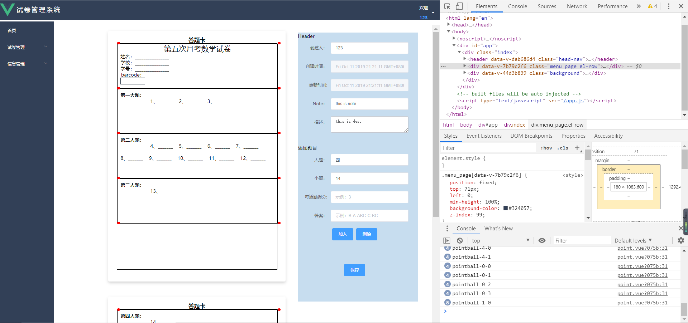

# escore

# 项目启动

# 启动：

+ mysql：services/config/mysql/config.js里面配置用户密码，然后导入sql脚本storage/expaper.sql
+ 后端：在services下，npm install然后启动或者配置idea环境 启动
+ 前端：在gui/expaper-client下，npm install 后启动

## 项目目录说明 
+ /docs      开发相关文档及说明
+ /services  后端nodejs服务器
+ /gui       前端vue-cli服务器
+ /storage   储存相关

## 前端

1.项目位于在GUI/expaper-client里

2.说明在GUI/expaper-client/readme.md，请按说明启动。

##  后端

1.项目位于services里，在/config/mysql里面配置数据库账户密码！

2.在/config/main里面配置项目，默认即可。

3.在services里运行npm install，安装依赖或者手动安装

4.运行： node ./services/bin/www 或 使用idea直接启动www

5.打开 http://localhost:3000/expaper

# 更新 

+ 每次更新内容放在各自目录下了

## 1.mysql数据库配置

+ 采用mysql数据库

+ ORM持久化数据库:sequelize

## 2.Vue.js配置

+ vue
  - 脚手架 vue-cli
  - 请求处理 axios
  - 组件 element-ui
  - ...
  
  

## 3.Node.js配置

+ express框架
  - 身份验证 bcryptjs token jwt passport passport-jwt
  - body-parser
  - ...

# 开发环境

 Ubuntu

# Services目录结构

+ --bin
  - |-www		程序入口
+ --config	配置
  - |-main		程序配置
  - |-mysql		数据库配置
+ --handler	业务模块
  - |-main.js
+ --models	模型模块
  - |-db
  - |--db.js
+ --public	公共资源
+ --routers	路由模块
  - |-index.js
+ --views		网页模块
+ --app.js	app配置

## 开发文档。

  -模块化项目 
  
  -在/models/db中编写mysql操作模型
  
  -在/router中编写各个路由模块
  
  -在/handler中编写业务
  
  -所有配置放在/config里
  
  -模板引擎放在views中

  -公共资源放在/public中，json数据打包在public/data
  
  
 # 前端预览：
 
   + 定位
     
   + 创建试卷雏形
     .jpgx)
     .jpgx)
    
     
   + 列表雏形
     .png)
     
     